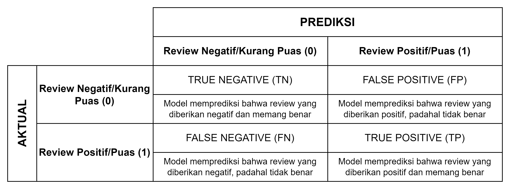

# AlphaGroup_JC_DS_OL_10_FinalProject

# **Business Problem Understanding**
## **Context**

**Kepuasan Pelanggan**

Menurut Irawan (2021), kepuasan pelanggan (Customer Satisfaction) dapat diartikan sebagai respon pelanggan (dalam bentuk perasaan) terhadap produk atau jasa yang sudah dikonsumsi atau diterima oleh pelanggan itu sendiri. Kemudian, menurut Kotler dan Keller (2016), kepuasaan pelanggan menggambarkan penilaian pelanggan terhadap kinerja produk/jasa yang dikaitkan dengan ekspektasi atau harapan terhadap produk/jasa tersebut. Dengan kata lain, apabila kinerja produk/jasa yang digunakan sesuai dengan ekspektasi/harapan pelanggan, maka pelanggan akan memberikan respon yang positif (puas, senang, dsb). Sebaliknya, apabila kinerja produk/jasa tidak sesuai dengan ekspektasi/harapan pelanggan, maka pelanggan akan memberikan respon yang negatif (kecewa, marah, dsb).

**Dampak Kepuasaan Pelanggan**

Kepuasaan pelanggan merupakan salah satu faktor penting yang harus dipertahankan dan ditingkatkan secara terus-menerus, demi keberlangsungan bisnis di masa mendatang. Pelanggan yang puas akan memiliki kemungkinan yang lebih besar untuk kembali melakukan transaksi (menjadi langganan/loyal) dan merekomendasikan bisnis ke orang lain (memberikan influence) secara sukarela, yang tentunya akan mempengaruhi reputasi dan keuntungan/profit yang diterima oleh bisnis tersebut. Sedangkan pelanggan yang tidak puas dapat dipastikan tidak akan melakukan transaksi kembali (akan berpindah ke kompetitor di bidang yang serupa) dan juga tidak akan merekomendasikan bisnis ke orang lain, sehingga dapat mengkibatkan kerugian finansial maupun reputasi. Namun, hal tersebut juga bergantung pada jenis bisnis yang dijalani. Apabila bisnis yang dijalani tidak memiliki kompetitor atau tidak memiliki substitusi lain (misalnya PLN di Indonesia), maka dampak kepuasaan pelanggan tidak akan terlalu signifikan jika dibandingkan dengan bisnis yang memiliki banyak kompetitor atau substitusi (misalnya bisnis retail).

**Faktor yang mempengaruhi kepuasan pelanggan**

Menurut Indrasari (2019), ada 5 faktor yang dapat mempengaruhi kepuasan pelanggan yaitu:
1. Kualitas Produk
2. Kualitas Pelayanan
3. Emosional (rasa bangga saat memiliki)
4. Harga (kualitas yang sama dengan harga yang lebih murah)
5. Biaya (tidak adanya waktu dan/atau biaya tambahan untuk mendapatkan produk)

Namun secara lebih detail, ada banyak faktor turunan lainnya yang dapat mempengaruhi kepuasaan pelanggan, dimana faktor-faktor tersebut tentunya akan berbeda pada setiap jenis/bidang bisnis yang dijalankan.

(sumber: http://repository.stei.ac.id/7345/3/%28BAB%202%29.pdf)

## **Problem Statement**

Olist Store merupakan salah satu departement store terbesar di Brazil yang bergerak di bidang Marketplace. Olist menghubungkan banyak bisnis kecil di seluruh Brazil untuk diekspos ke konsumen. Para pemilik bisnis tersebut dapat menjual barangnya melalui channel Olist, kemudian mengantarkan barang tersebut ke pembeli melalui perusahaan logistik yang bekerja sama dengan Olist. Setelah barang diterima oleh pembeli, atau jika sudah melewati batas waktu pengiriman yang ditentukan, email yang berisi survey kepuasaan pelanggan akan dikirimkan ke pembeli. Survey kepuasan tersebut dapat diisi dengan rating (skala 1-5) dan komentar terkait produk ataupun pengalaman yang mereka rasakan selama berbelanja dengan Olist.

Sesuai dengan poin di latar belakang, **kepuasan pelanggan merupakan salah satu faktor penting yang perlu diperhatikan untuk mempertahankan kelangsungan bisnis di masa mendatang**. Terlebih lagi jika bidang bisnis yang digeluti memiliki banyak kompetitor dan substitusi lain seperti departement store.

Oleh karena itu, **Olist perlu memastikan terjaganya kepuasaan pelanggan dari berbagai sisi**, mulai dari sisi kualitas produk yang ditawarkan oleh para bisnis yang bekerjasama dengan Olist, dari sisi pengiriman (shipping) produk yang dilakukan oleh pihak logistik yang bekerja sama dengan Olist, dari segi harga dan lokasi beserta faktor-faktor lainnya, sehingga Olist tetap dapat menjadi pilihan utama pelanggan untuk berbelanja dan tentunya meningkatkan profit yang diterima oleh Olist.

## **Goals**

Berdasarkan permasalahan tersebut, dapat dirumuskan beberapa goal yaitu:
1. Perusahaan ingin memiliki kemampuan untuk **memprediksi kemungkinan sebuah produk yang ditransaksikan memiliki review puas (rating 4-5) atau kurang puas (rating 1-3)**, sehingga dapat diterima masukan guna melakukan perbaikan yang mampu meningkatkan retensi pelanggan dengan harapan mengoptimalkan biaya terkait pelanggan (Customer Acquisition Cost dan Custumer Retention Cost) serta meningkatkan profit yang diterima perusahaan.

2. Perusahaan juga ingin mengetahui **seberapa besar pengaruh faktor/variabel dalam transaksi pelanggan yang menyebabkan sebuah transaksi memiliki review yang positif (puas) atau negatif (kurang puas)**, sehingga Olist dapat memfokuskan rencana dan kebijakan yang lebih baik dalam rangka meningkatkan kepuasan pelanggan.

3. Olist dapat **memperoleh rekomendasi terkait perbaikan/peningkatan yang dapat dilakukan guna mempertahankan dan meningkatkan kepuasaan pelanggan**, sehingga juga **mempertahankan kelangsungan bisnis di masa mendatang**.

## **Analytic Approach**

Oleh karena itu, perlu dilakukannya **analisis data** untuk mengetahui **pengaruh faktor-faktor yang dapat mendorong pelanggan untuk memberikan review positif atau negatif** saat bertransaksi dengan Olists. Dari analisis yang dilakukan, dapat juga **dirumuskan beberapa rekomendasi terkait peningkatan/perbaikan untuk Olist**.

Selain itu, **akan dibangun juga model klasifikasi yang dapat membantu Olist untuk memprediksi review yang akan diberikan oleh pelanggan (review_score) dalam suatu transaksi berdasarkan berbagai faktor** yaitu:
| No.| Fitur | Sumber Dataset |Keterangan
--- | --- | --- | ---
| 1. | Product Category | product_category_name_translation.csv | Kategori Barang (sudah diubah kedalam bahasa inggris)
| 2. | Product Description Length | olist_products_dataset.csv | Banyaknya karakter dalam deskripsi produk
| 3. | Photos Quantity | olist_products_dataset.csv | Banyaknya foto produk yang ditampilkan
| 4.| Price | olist_order_items_dataset.csv | Harga Barang
| 5.| Freight value |olist_order_items_dataset.csv | Ongkos Kirim
| 6. | Seller State | olist_sellers_dataset.csv | Lokasi Penjual
| 7. |Customer State|olist_customers_dataset.csv|Lokasi Pelanggan
| 8. | Time Order to Estimated Delivery | olist_orders_dataset.csv | Estimasi lama pengiriman (order_estimated_delivery_date - order_purchase_timestamp)
| 9. | Order Status | olist_orders_dataset.csv | Status pesanan (delivered or not)
| 10. | Delivery Performance | olist_orders_dataset.csv | Kinerja pengiriman barang
| | | | (**early**: barang sampai lebih cepat dari perkiraan,
| | | | **on-time**: barang sampai sesuai dengan perkiraan,
| | | | **delayed**: barang sampai lebih lama dari perkiraan)

## **Metric Evaluation**

**Type I Error (False Positive):**

Model memprediksi review yang diberikan puas, padahal yang terjadi sebaliknya.

Jika ulasan kurang puas salah diklasifikasikan sebagai puas, hal ini dapat mengaburkan masalah sebenarnya yang perlu diperbaiki pada produk atau layanan yang disediakan oleh Olist, sehingga berujung pada ketidakpuasan pelanggan.

**Type II Error (False Negative):**

Model memprediksi review yang diberikan kurang puas, padahal yang terjadi sebaliknya. Akibatnya, Olist mendapat masukan yang kurang tepat untuk melakukan perbaikan (atau bahkan tidak perlu melakukan perbaikan) sehingga menimbulkan kerugian waktu dan biaya untuk mengatasi masalah yang belum tentu benar adanya.

Berdasarkan risiko keduanya, maka model yang dibuat nantinya harus memberikan prediksi yang akurat, terlebih lagi dalam memprediksi review kurang puas secara akurat (meminimalkan False Positive). Hal tersebut sesuai dengan tujuan dilakukannya project ini, yaitu untuk mempertahankan dan meningkatkan kepuasaan pelanggan Olist, sehingga review kurang puas sebisa mungkin tidak terlewatkan karena berisi informasi berharga yang dapat dijadikan acuan untuk melakukan perbaikan sistem atau kebijakan di Olist. Oleh karena itu, **metrik evaluasi yang digunakan akan memberikan bobot yang lebih besar pada Precision ketimbang Recall, yaitu F-0.5 Score**.
